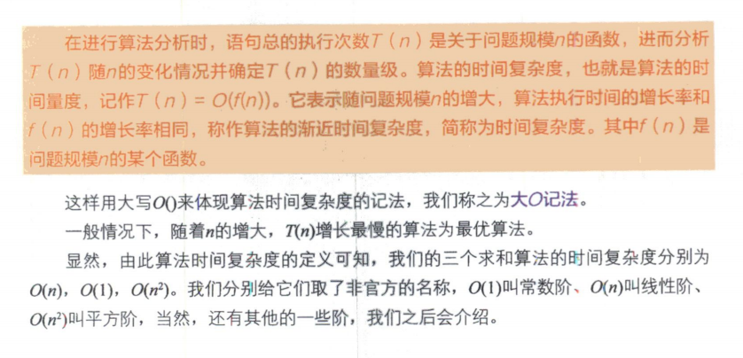
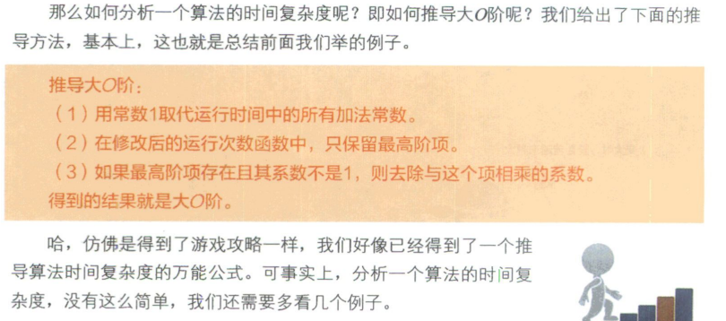
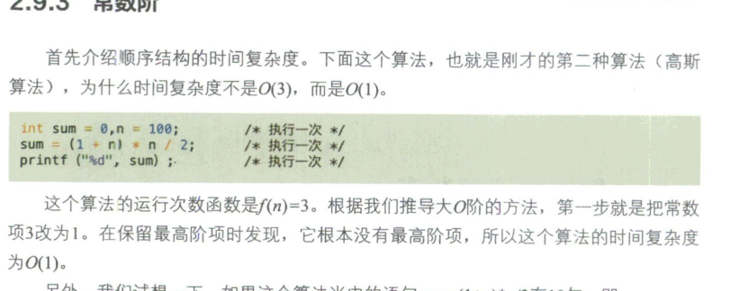
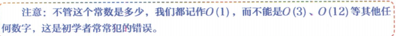
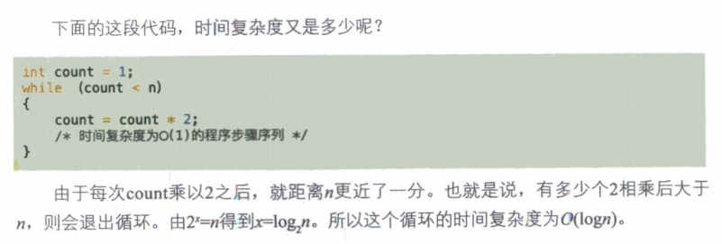
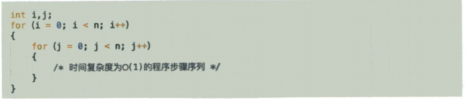
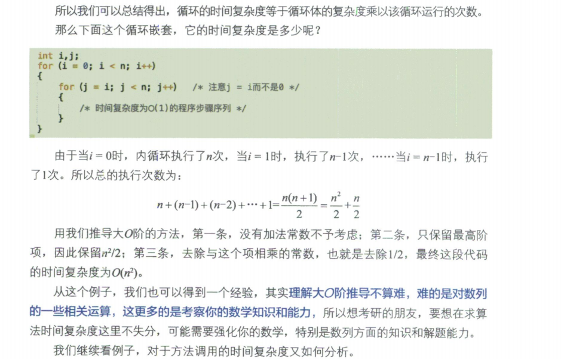
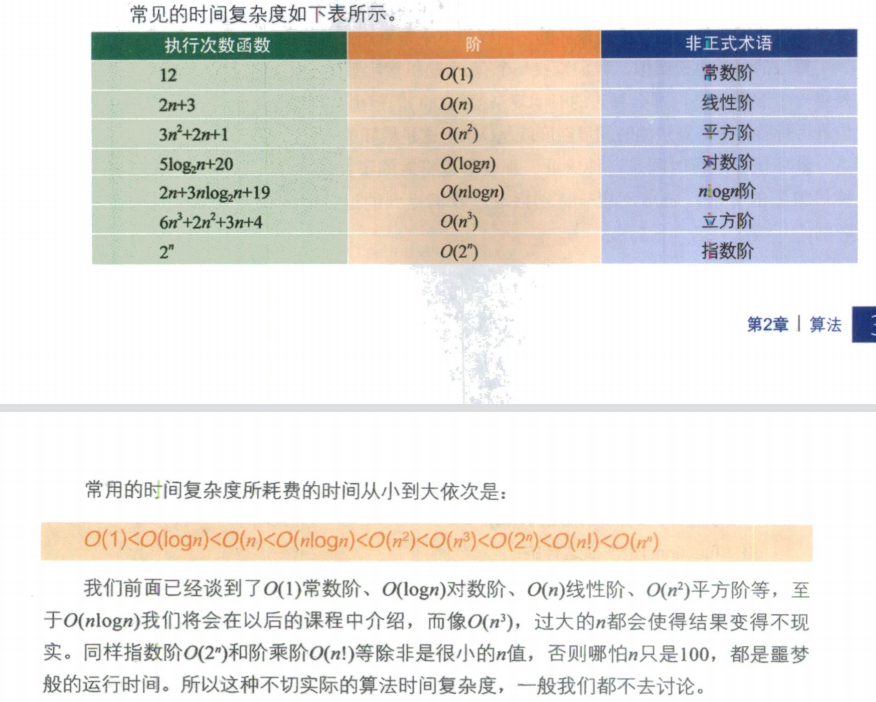
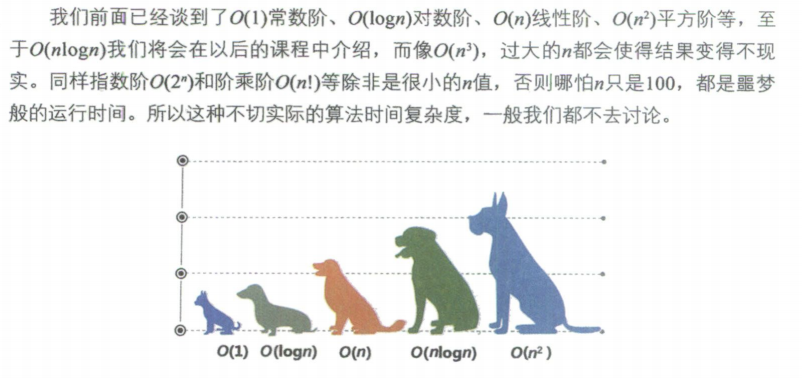
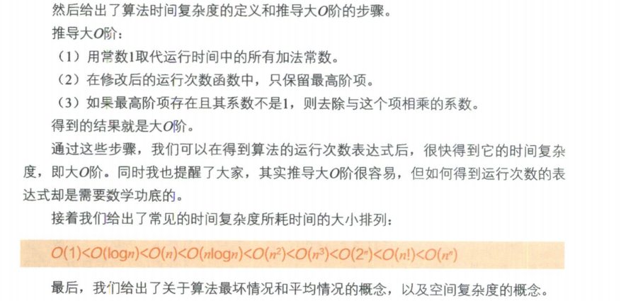

### 1.算法时间复杂度

#### 1.1 算法时间复杂度的定义

#### 1.2 大O阶的推导方法

#### 1.3 常见的时间复杂度

##### 1.3.1 常数阶

没有复杂的循环等语句，只有简单的顺序执行，如下就是，时间复杂度就是O(1)。

___

> **常数阶都是O(1)**

##### 1.3.2 对数阶

##### 1.3.3 平方阶

时间复杂度为O(n²)

___

根据推导方法，下面这个算法时间复杂度也是O(n²)

___

**常见的时间复杂度：**

___

**大小关系：**

##### 1.3.4 最后总结

###  2.线性表

**定义**：零个或多个数据元素的有限序列。

**实现方式**：数组和链表

**数组实现优点：**读取数据较快，时间复杂度为O(1),

**缺点：**添加数据和删数据较慢，首先需要遍历找到数据，添加或者删除成功后还需要移动后面的每一个数据，时间复杂度为O(n)   (n+n)。

____

**链表实现优点：** 添加和删除元素较快，只需要先编辑找到需要操作相关位置的节点，断开连接重新连接赋值即可， 相比数组不需要后面位移那些操作，时间复杂度为O(n)。

**缺点：**读取某个数据需要遍历查找，时间复杂度为O(n)。

###  3.栈和队列

**栈的特点**：先进后出，典型应用例子有：

1.浏览器的后退键，最先后退（出栈）的，就是你刚刚浏览（入栈）的。

2.递归

3.后缀（逆波兰）表达式的实现，解决计算器复杂四则运算的问题，例如9+(3-1)*3+10/2,转换为后缀表达式9 3 1-3 * + 10 2 / +。 计算机就可以将转换后的式子计算出来。

**栈和队列都可以用数组或者链表将他们实现出来。**

----

### 4.串

理解：就是一串字符串，一般用数组实现，链表也可以将它实现，但各方面性能没有数组好。

#### 4.1 KMP模式匹配算法

现有两个串，一个主串A:abcdefgab，一个字串B:abcdex,判断B是否是A的字串。

最基本的方法就是从小的串开始一个一个去和主串对比，从第一个字符开始，直到最后一个字符。

这种方式虽然可以实现，但是性能极低，KMP算法就是为了检查中间那些无用重复的对比过程，

**思路**：先去分析字串B是否有重复的字母，若有，那么中间某些判断是可以省略的，分析串B得到一个NEXT数组，再根据KMP算法去和主串匹对，完成判断。（具体实现细节见大话数据结构或者百度。）

